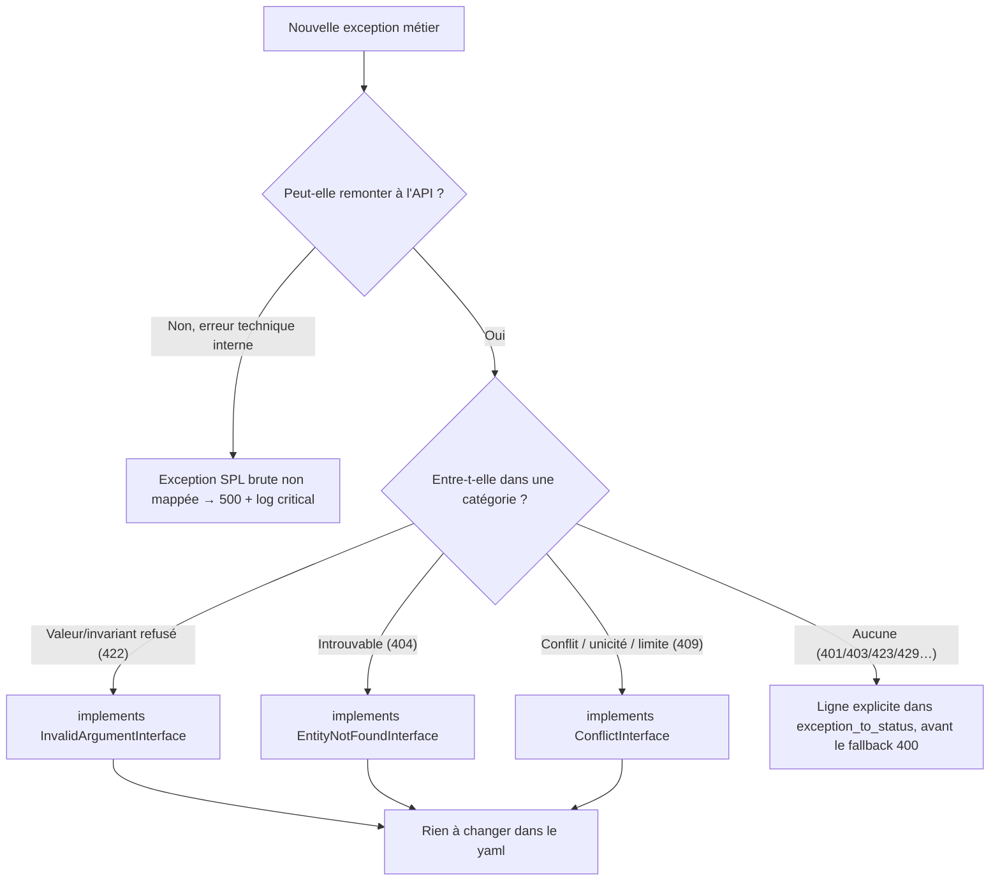

# Gestion des exceptions → statuts HTTP

> Référence technique. Les règles font foi dans les `AGENTS.md` (`domain/AGENTS.md` § « Exceptions métier »).
> Ce document explique **le mécanisme** : où vit le mapping, comment API Platform résout le statut, et
> comment ajouter une exception sans alourdir la configuration.

---

## TL;DR

- Une exception du Domain qui remonte jusqu'à l'API est convertie en statut HTTP par
  **`config/packages/api_platform.yaml`** → clé `api_platform.exception_to_status`.
  ⚠️ **Pas** dans `config/routes/api_platform.yaml` (celui-ci ne fait que déclarer la route sous `/api`).
- Le mapping ne se fait **plus classe par classe**. Trois **interfaces marqueur** sémantiques portent les
  catégories courantes ; chaque exception `implements` la sienne et hérite du statut.
- Seuls les cas hors catégorie (401/403/423/429…) restent des lignes explicites.

---

## Où vit quoi

| Fichier | Rôle |
|---|---|
| `config/routes/api_platform.yaml` | Déclare la route API Platform (`prefix: /api`). **Rien à voir avec les exceptions.** |
| `config/packages/api_platform.yaml` → `exception_to_status` | Table exception/interface → code HTTP. |
| `domain/SharedKernel/src/Exception/` | `DomainException` (base) + les 3 interfaces sémantiques. |
| `domain/<Context>/src/**/Exception/` | Bases par BC (`UserDomainException`, …) + feuilles ciblées. |

---

## Les deux axes

Une exception métier se classe selon **deux axes indépendants**, portés par deux mécanismes PHP différents :

```text
                      DomainException (SharedKernel)  ── fallback 400
                              ▲
        ┌─────────────────────┼─────────────────────┐      axe « bounded context »
   UserDomainException  CatalogDomainException  CartDomainException…   (héritage de classe)
        ▲
   UserNotFoundException  ── implements EntityNotFoundInterface ──▶ 404   axe « sémantique »
                                                                         (interface marqueur)
```

- **Axe bounded context** = *chaîne d'héritage*. `UserNotFoundException extends UserDomainException extends
  DomainException`. Il sert au regroupement par contexte : les `throw new UserDomainException(...)` directs
  (tokens, invariants divers) et les `expectException(UserDomainException::class)` des tests en dépendent.
  C'est aussi lui qui fournit le **fallback 400**.
- **Axe sémantique** = *interface marqueur*. La feuille `implements` la catégorie décrivant **ce qui s'est
  passé**, quel que soit le BC. C'est cet axe qui pilote le statut 4xx.

Pourquoi deux mécanismes ? L'héritage simple de PHP ne permet qu'**un** parent : il est déjà pris par le BC.
Les catégories transverses (« introuvable », « conflit », « argument invalide ») traversent tous les BC → elles
sont donc modélisées en **interfaces**, qu'une classe peut cumuler avec son héritage. API Platform matche les
deux via `is_a()` (voir plus bas), donc une interface dans `exception_to_status` fonctionne exactement comme une
classe.

### Les 3 catégories sémantiques

| Interface (`SharedKernel\Exception\…`) | Statut | Sens métier |
|---|---|---|
| `InvalidArgumentInterface` | **422** | Invariant violé, valeur refusée par un VO/agrégat |
| `EntityNotFoundInterface` | **404** | Agrégat/entité recherché introuvable |
| `ConflictInterface` | **409** | Unicité violée, limite atteinte, ressource déjà existante |

Les interfaces ne mentionnent **aucun** code HTTP : le Domain ignore HTTP, la correspondance code↔catégorie
n'existe que dans le yaml.

---

## Comment API Platform résout le statut

`ApiPlatform\Symfony\EventListener\ErrorListener::getStatusCode()` (≈ ligne 167) itère la table dans
**l'ordre déclaré** et renvoie le statut du **premier** `is_a()` vrai :

```php
foreach ($exceptionToStatus as $class => $status) {
    if (is_a($exception::class, $class, true)) {   // matche classes ET interfaces, parents inclus
        return $status;                            // 1er match gagne → l'ordre est significatif
    }
}
```

Deux conséquences :

1. **`is_a(..., allow_string: true)` matche l'héritage ET les interfaces.** On peut donc mapper une interface
   (`InvalidArgumentInterface`) et toutes ses implémentations héritent du statut, sans être listées.
2. **Le premier match gagne** → il faut classer **du plus spécifique au plus générique** :
   cas particuliers d'abord, catégories ensuite, `DomainException: 400` **en dernier**.

Si aucune ligne ne matche, API Platform retombe sur son comportement par défaut (500 pour une exception non
mappée) — c'est voulu pour les erreurs techniques (voir `domain/AGENTS.md` § « Exception vs Error »).

---

## Ordre du fichier (invariant à préserver)

```yaml
# config/packages/api_platform.yaml
exception_to_status:
    # 1. Cas spécifiques : sémantique propre (sécurité / rate-limit), pas une simple catégorie
    App\Domain\User\Exception\Security\InvalidCredentialsException: 401
    App\Domain\User\Exception\Security\InvalidRefreshTokenException: 401
    App\Domain\User\Exception\Security\AccountNotActivatedException: 403
    App\Domain\User\Exception\Security\UserLockedException: 423
    App\Domain\User\Exception\RateLimit\ActivationLimitReachedException: 429
    App\Domain\User\Exception\RateLimit\ResetPasswordLimitReachedException: 429
    # 2. Catégories sémantiques (interfaces, match par is_a)
    App\Domain\SharedKernel\Exception\InvalidArgumentInterface: 422
    App\Domain\SharedKernel\Exception\ConflictInterface: 409
    App\Domain\SharedKernel\Exception\EntityNotFoundInterface: 404
    # 3. Fallback : toute DomainException non catégorisée (inclut les bases par BC)
    App\Domain\SharedKernel\Exception\DomainException: 400
```

> Les cas spécifiques doivent rester **avant** le fallback. Entre eux et les interfaces, l'ordre n'a pas
> d'importance (ces exceptions n'implémentent aucune interface de catégorie), mais on les garde en tête par
> lisibilité.

---

## Ajouter une exception : arbre de décision



En pratique, pour une exception qui entre dans une catégorie :

```php
final class OrderAlreadyPaidException extends CartDomainException implements ConflictInterface
{
    public function __construct()
    {
        parent::__construct('Order is already paid.');   // message métier, jamais de code HTTP
    }
}
```

→ 409 automatiquement, aucune modification de configuration.

---

## Table de référence (état courant)

**422 — `InvalidArgumentInterface`**
`InvalidUuidException` (SharedKernel) · `InvalidEmailAddressException` · `InvalidFirstnameException` ·
`InvalidLastnameException` · `InvalidRoleException` · `InvalidUsernameException` ·
`Security\InvalidCurrentPasswordException` · `Security\SamePasswordException` · `Profile\InvalidAvatarException`
(User) · `Ordering\CartQuantityExceededException` (Shop)

**404 — `EntityNotFoundInterface`**
`UserNotFoundException` (User) · `Catalog\CategoryNotFoundException` · `Catalog\ProductNotFoundException` ·
`Customer\AddressNotFoundException` · `Customer\CustomerNotFoundException` · `Ordering\CartLineNotFoundException`
(Shop)

**409 — `ConflictInterface`**
`Catalog\CategoryTitleAlreadyUsedException` · `Catalog\ProductTitleAlreadyUsedException` ·
`Customer\AddressLimitReachedException` · `Customer\CustomerAlreadyExistsException` (Shop) ·
`Uniqueness\EmailAlreadyUsedException` · `Uniqueness\UsernameAlreadyUsedException` (User)

**Cas spécifiques (lignes explicites)**
401 `InvalidCredentialsException`, `InvalidRefreshTokenException` · 403 `AccountNotActivatedException` ·
423 `UserLockedException` · 429 `ActivationLimitReachedException`, `ResetPasswordLimitReachedException`

**400 — fallback `DomainException`**
Toute exception Domain non catégorisée, y compris les bases par BC (`ShopDomainException`,
`UserDomainException`, `CatalogDomainException`, `CustomerDomainException`, `CartDomainException`) et les
`throw new <BC>DomainException(...)` directs.

---

## Voir aussi

- `domain/AGENTS.md` § « Exceptions métier » et § « `Exception` métier vs `Error` technique ».
- `ApiPlatform\Symfony\EventListener\ErrorListener` (vendor) pour la résolution effective du statut.
